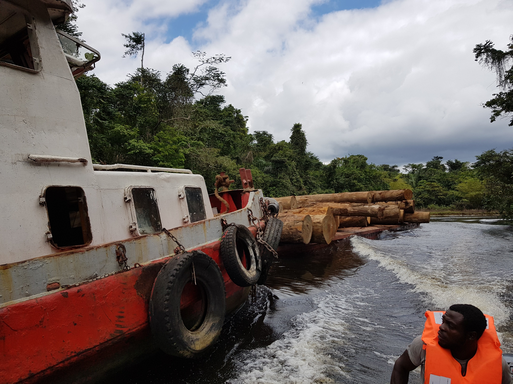

# Africas-Tropical-Forests
[Africa’s Tropical Forests](FADAIR2025_AfricasTropicalForests.pdf) 
Citation: Adair, F. J. (2026). Africa's Tropical Forests. Zenodo. https://doi.org/10.5281/zenodo.20572891

 
Central Africa is home to the Guineo-Congolian rainforests that have persisted in one form or another for millions of years. Gorillas have evolved alongside the forests but habitat loss and the bushmeat trade threaten their continued existence. Increasing temperatures from climate change is drying soil and excessive atmospheric CO2 is altering vegetation compositions. Suitable agricultural land is adversely affected and so more forest is cleared in a feedback loop as fertile soils become increasingly rare. Logging practices could be made more sustainable but are generally destructive and pave the way for large-scale human habitation at the expense of biodiversity. In response to local, regional, and global pressures forest dependent and indigenous communities' are being driven to unsustainably exploit the forest too. Since their livelihoods and access to land are being drastically altered, developing a strategy to support these people must go beyond reducing pollution to meet climate goals. If correctly perceived and implemented then the conservation of tropical rainforest can contribute to both adaptation and mitigation actions. 
 
Gabon and Cameroon have designated a number of national parks but wildlife and forest degradation is ongoing and climate change is making matters worse. Ecotourism offers a source of revenue for keeping ecosystems intact, but cannot compete with the economic returns of extractive industries like logging. Ecosystem Services are a school of thought that try to value the conservation of ecosystems but contrasting facts and opinions make defining ES difficult. Nevertheless, conservationists must consider a cost-benefit analysis when deciding where or what to attempt to conserve which means also understanding the effects of climate change and local contexts. The biota of protected areas may need to migrate in response to climate change and so linking protected areas together or conserving large expanses of habitat could help to avoid extinctions. Models are needed that can accurately predict land use change and species migration but high quality data is lacking for Central Africa. The emergence of cheap technologies that can be deployed to collect lots of data in the field is making conservation aims more achievable. 
 

